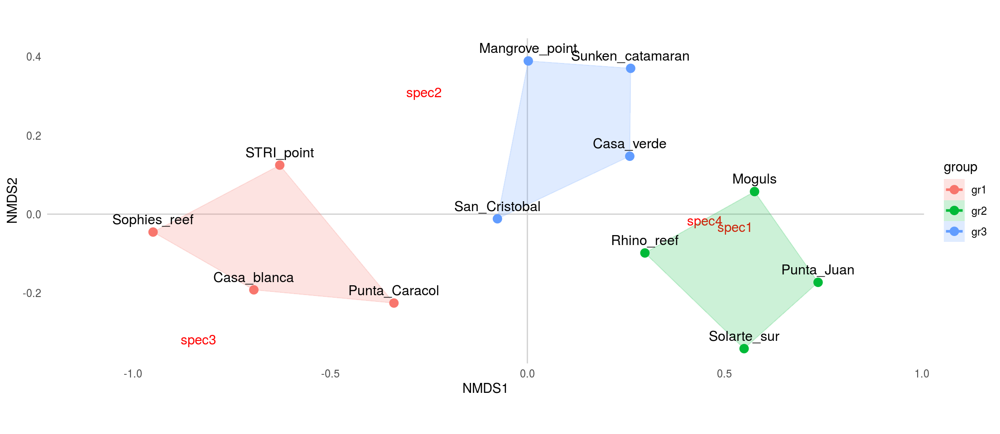
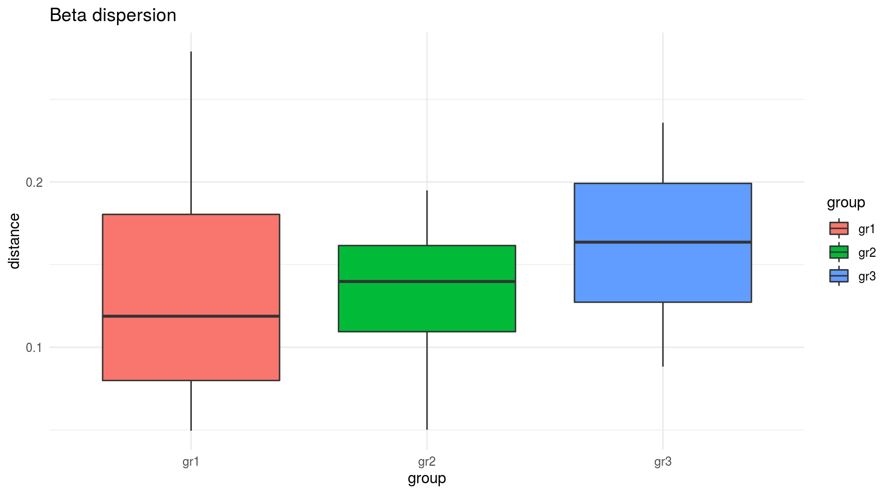
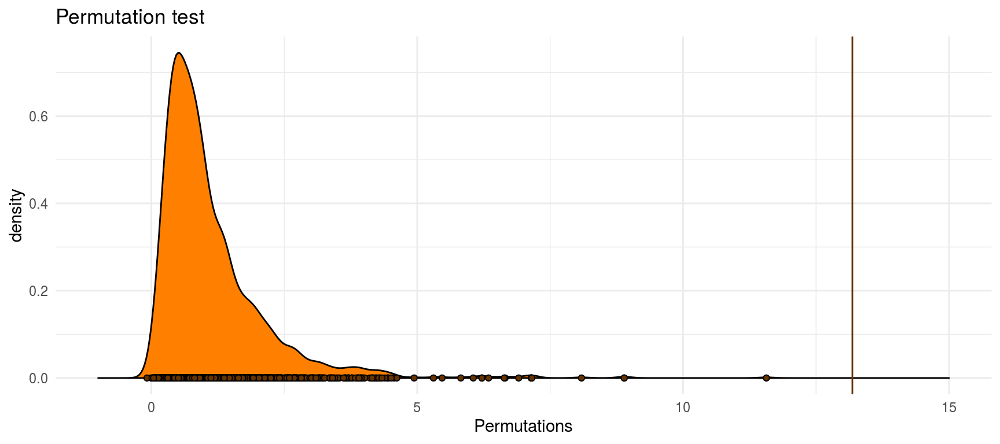

# NMDS/PERMANOVA template

This template is based on the methods from the @Hench17 paper which compares hamlet observation at Puerto Rico reefs from 2000 (by Aguilar et al. 2003) and from 2017. The data that is used is completely made up though.

Here we will generate NMDS plots and run a PERMANOVA to test the significance between the different clusters of three fictional reef types.

Most of the analysis makes use of the functions provided by the **vegan** package (mostly `metaMDS()` and `adonis()`). Plotting is done using the **ggplot2** package (included in **tidyverse**) with the extension packages **cowplot** and **ggalt**.

------

To start our **R** session we have to  **load the required R packages** and set up our working environment: 

```r
library(vegan)

library(tidyverse)
library(cowplot)
library(ggalt)

darken <- function(color, factor = 1.4){
  col <- col2rgb(color)
  col <- col/factor
  col <- rgb(t(col), maxColorValue = 255)
  col
}
```

Then we have to **read in the data** (provided in the data folder).
The original data contains the observations as well as meta data (sampling location and and sample group):

```r
data <- read_delim('permanova/data/more_sampling_spots.csv', delim = '\t') %>% select(-Latittude, -Longitude)
```


spot               group    spec1   spec2   spec3   spec4
-----------------  ------  ------  ------  ------  ------
STRI_point         gr1          1       4       5       1
Casa_blanca        gr1          1       3       4       0
Punta_Juan         gr2          5       0       1       4
Punta_Caracol      gr1          0       3       3       3
Mangrove_point     gr3          2       5       0       2
Moguls             gr2          5       2       0       5
Rhino_reef         gr2          4       2       1       2
Sophies_reef       gr1          1       3       7       0
Sunken_catamaran   gr3          4       5       0       2
San_Cristobal      gr3          1       3       1       3
Casa_verde         gr3          3       3       0       5
Solarte_sur        gr2          5       0       2       3

------

## NMDS

To be able **execute the NMDS** the species observations need to be exported as a *matrix object*. Here we are going to run the NMDS based on the Bray-Curtis distance between the samples using a max of 500 iterations.


```r
dataM <- data %>% select(spec1:spec4)  %>% as.matrix()
rownames(dataM) <- data$spot

NMDSout <- metaMDS(dataM, k = 2, trymax = 500, distance = 'bray')
```

After we ran the NMDS, we have to export the scores both of the samples as well as of the species for plotting in **ggplot2**:

First, we extract the sample scores to a `data.frame` object using the `scores()` function from the **vegan** package and add a column to include the samples names.

Than we do the same for the species.

Finally, we merge the sample scores back to our original data set. 


```r
data.scores <- as.data.frame(scores(NMDSout))
data.scores$spot <- rownames(data.scores)

species.scores <- as.data.frame(scores(NMDSout, "species"))
species.scores$species <- rownames(species.scores)

data <- data %>% left_join(data.scores)
```

```
## Joining, by = "spot"
```

Now, we can **plot the results of the NMDS** using **ggplot2**:


```r
# initializing the plot
ggplot(data, aes(x = NMDS1, y = NMDS2, group = group)) + 
  # fixed aspect ration for x and y scale
  coord_equal() +
  # adding line ad x = 0 and y = 0
  geom_hline(yintercept = 0, color = 'lightgray')+
  geom_vline(xintercept = 0, color = 'lightgray')+
  # add the species labels
  geom_text(inherit.aes = F, data = species.scores, 
            aes(x = NMDS1, y = NMDS2, label = species), 
            col = 'red') +
  # add the sample positions
  geom_point(aes(colour = group), size = 3) +
  # add the outer hull of the three groups (function from the ggalt package)
  geom_encircle(aes(colour = group, fill = group), 
                s_shape = 1, alpha = 0.2, size = 1, expand = 0)+
  # add the sample labels
  geom_text(aes(label = spot), size = 4, vjust = 0, nudge_y = .02) +
  # change the coler map (from the hrbrthemes package)
  scale_x_continuous(expand = c(.1, .1))+
  theme_minimal()+
  theme(panel.grid = element_blank())
```



------

## PERMANOVA

Although we can visually inspect our NMDS plot for differences between our 3 groups, we do not know yet whether those differences are statistically significant.

To find out about this we need to run a permanova on our data.
Yet, before we start, we need to check if the assumptions for permanova are met by the data [@Anderson01]:

<center> *"The only assumption of the test is that [...] the observations are independent and that they have similar distributions"*</center>

To check for homogeneous dispersion, we can either use a statistical test (permutation test) or visualize the dispersion.

Either way, first we need to create the distance matrix (*again*, since it was not stored before but only computed internally within the `metaMDS()` function...).

Then we also need to find out in which order the sites are stored within the distance matrix (the order may differ from the original data) to assign the groups correctly. Than the beta dispersion can be computed and compared.


```r
#  compute Bray-Curtis distance
dM <- vegdist(dataM, distance = 'bray')
# get order of samples
gO <- data[match(labels(dM), data$spot), ]$group
# compute beta dispersion of the 3 groups
betaM <- betadisper(dM, gO)
# statistical test for homogeneous dispersion
permutest(betaM)
```

```
## 
## Permutation test for homogeneity of multivariate dispersions
## Permutation: free
## Number of permutations: 999
## 
## Response: Distances
##           Df   Sum Sq   Mean Sq      F N.Perm Pr(>F)
## Groups     2 0.002086 0.0010430 0.1771    999  0.825
## Residuals  9 0.053012 0.0058903
```

```r
# visual check for homogeneous dispersion
ggplot(data.frame(group = betaM$group, distance = betaM$distances), 
       aes(x = group, fill = group, y = distance))+
  geom_boxplot()+
  ggtitle('Beta dispersion')+
  theme_minimal()
```



If the dispersion is sufficiently homogeneous, we can **finally run the PERMANOVA** on the data (using the *adonis()* function from the vegan package):


```r
permM <- adonis(formula = dM ~ gO, permutations = 1999, method = 'bray')
print(permM)
```

```
## 
## Call:
## adonis(formula = dM ~ gO, permutations = 1999, method = "bray") 
## 
## Permutation: free
## Number of permutations: 1999
## 
## Terms added sequentially (first to last)
## 
##           Df SumsOfSqs MeanSqs F.Model      R2 Pr(>F)    
## gO         2   0.87737 0.43869  13.183 0.74552  5e-04 ***
## Residuals  9   0.29948 0.03328         0.25448           
## Total     11   1.17685                 1.00000           
## ---
## Signif. codes:  0 '***' 0.001 '**' 0.01 '*' 0.05 '.' 0.1 ' ' 1
```

A last thing we might want to do, is to get an overview over the Permutation Results from our PERMANOVA. We can compare our real case to the distribution created by the permutations:


```r
plot_clr <- rgb(1, .5, 0)
# export the summary statistics from the PERMANOVA run
permOUT <- permustats(permM)
# transform into da data.frame
permDF <- permOUT$permutations %>% as_tibble() %>% setNames(., nm = 'Permutations')

# plotting
ggplot(permDF, aes(x = Permutations))+
  # add the distribution frm the permutations
  geom_density(fill = plot_clr)+
  geom_point(aes(y = 0), shape = 21, fill = darken(plot_clr, 2.5))+
  # add our realized value
  geom_vline(xintercept = permOUT$statistic, col = darken(plot_clr, 2.5))+
  # expand x scale 
  scale_x_continuous(limits = c(-1, 15))+
  # plot title
  ggtitle('Permutation test')+
  theme_minimal()
```


