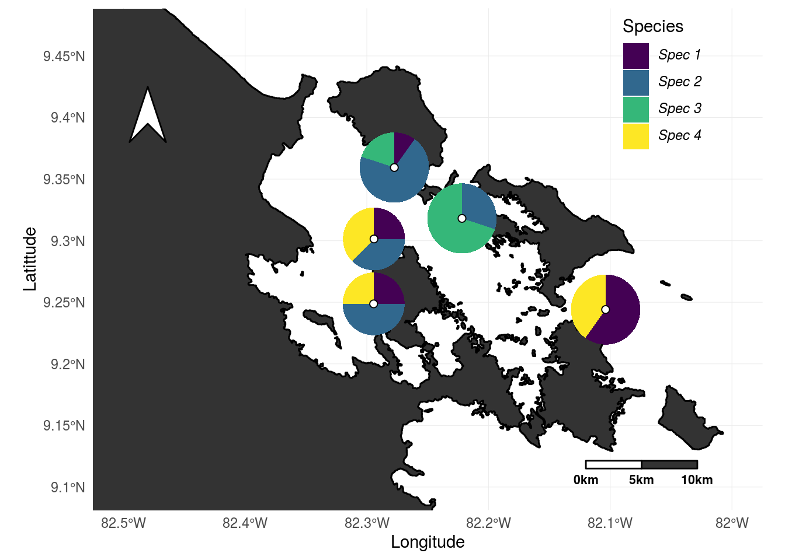
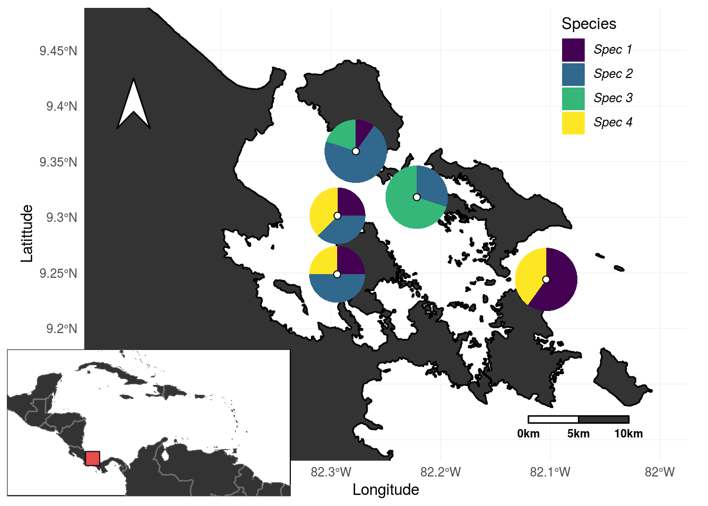

# Pie map template

This template is based on the methods form the @Hench17 paper which compares hamlet observation at Puerto Rico reefs from 2000 (by Aguilar et al. 2003) and from 2017. The data that is used is completely made up though.

Here we will generate a map of the sampling area including pie charts that represent a species community.

We will make heavy use of **ggplot2** package and several of its extensions (**ggmap**,**scatterpie**,**cowplot**). Further more we will need the **grid** packages and some of the Geo **R** packages: **maps**, **maptools** and **PBSmapping**.

------

To start our **R** session we have to  **load the required R packages** and set up our working environment: 


```r
library(tidyverse)
library(ggmap)
library(scatterpie)
library(cowplot)

library(sf)
library(maptools)
library(rnaturalearth)
library(rnaturalearthdata)

source('pie_map/functions.R')
```

Then we have to **read in the data** (provided in the pie_map data folder).
The original data contains the observations as well as meta data (sampling location and coordinates):


```r
data <- read_delim('pie_map/data/sampling_spots.csv',delim = '\t') %>% 
  mutate(all = spec1 + spec2 + spec3 + spec4)
```


 Latittude   Longitude  spot              spec1   spec2   spec3   spec4   all
----------  ----------  ---------------  ------  ------  ------  ------  ----
    9.3594    -82.2774  Casa_blanca           1       7       2       0    10
    9.3014    -82.2941  Punta_Juan            2       3       0       3     8
    9.2487    -82.2944  Mangrove_point        2       4       0       2     8
    9.2441    -82.1038  Rhino_reef            6       0       0       4    10
    9.3181    -82.2218  Solarte_sur           0       3       7       0    10

We will now define the limits of our map and read in the detailed shape-file which we got from [gadm.org](http://www.gadm.org/country) and copied to the data folder.

After loading the shape-file, we are going to clip it according to the previously defined map boundaries and reformat it to be compatible with **ggplot2**:


```r
# setting map boundaries
xlim = c(-82.5,-82); ylim = c(9.1,9.47)

# reading in Panama shapefile
panama <- sf::st_read('pie_map/data/geography/PAN_adm0.shp')
bb <- bbox(xlim,ylim)
panama_cliped <- st_intersection(bb,panama)
#reformating shapefile to work with ggplot2
```

Next we will prepare our labels and colors for the pie charts.


```r
# definig species label for legend
spec_labs <- expression(italic("Spec 1"),italic("Spec 2"),italic("Spec 3"),italic("Spec 4"))

# setting colors for the land mass
cFILL <- rgb(.2,.2,.2)
```

Then we are going to produce the main map:

```r
plot1 <- ggplot()+
  # plot the land mass
  geom_sf(panama, mapping = aes(), fill = cFILL, col = 'black')+
  coord_sf(xlim=xlim,ylim=ylim)+
  # plot the pies
  geom_scatterpie(aes(x=Longitude, y=Latittude, group=spot, r=sqrt(all/1250)/pi),
                  data=data,
                  cols=c("spec1","spec2","spec3","spec4"),
                  color=rgb(0,0,0,0),lwd=.3)+
  scale_fill_viridis_d(name='Species',label=spec_labs)+
  # add points to the exact sampling points
  geom_point(data=data,aes(x=Longitude,y=Latittude),shape=21,fill='white',size=2)+
  # the lines below adds labels - this will probably look messy,
  #but it can be sorted using inkscape or adobe illustrator
  # geom_text(data=data,aes(x=Longitude,y=Latittude,label=spot),size=3)+
  # add compass
  geom_north(xscale = 1.5,lon = -82.48,lat = 9.35, fill='white',col='black')+
  # add scale bar
  scaleBar(lon = -82.12, lat = 9.115, distanceLon = 5, distanceLat = .7,
           distanceLegend = -1, dist.unit = "km", orientation = F,
             rec2.fill = cFILL,legend.size = 2)+
  # layout
  theme_minimal()+
  theme(legend.position = c(.85,.85))
```


Then we are going to create a secondary map to indicate the general position within the Caribbean.
First we are going to define the boundaries of the secondary map, than we are going to load the world data (included in **R**), format it for use with **ggplot2** and clip it at the boundaries.

```r
# settings for Caribbean overview
xlimW = c(-93,-55); ylimW = c(5,24)
world <- ne_countries(scale = "medium", returnclass = "sf")

# Caribbean map:
plot2 <- ggplot() +
  geom_sf(data = world,fill = cFILL,col=rgb(1,1,1,.2))+
  coord_sf(xlim = xlimW, ylim = ylimW, datum = NA)+
  geom_point(data = data[1,], aes(x = Longitude,y = Latittude),
             fill=rgb(.9,.3,.3),
             shape = 22,size = 5,col = 'black')+
  theme_void()+
  theme(panel.background = element_rect(fill='white',color='black'))
```


Finally, we use the **cowplot** package to combine the two plots:



If we want, we can now export the map and tweak last details using inkscape or adobe illustrator:

```r
ggsave('pie_map.pdf',width = 8,height = 6,device=cairo_pdf)
```
